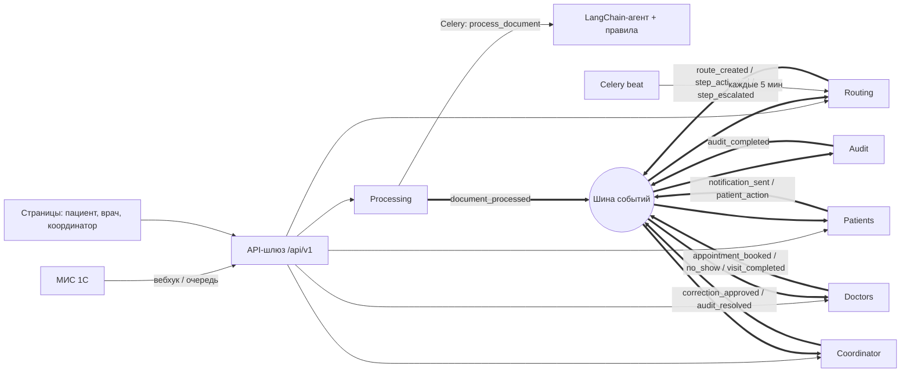
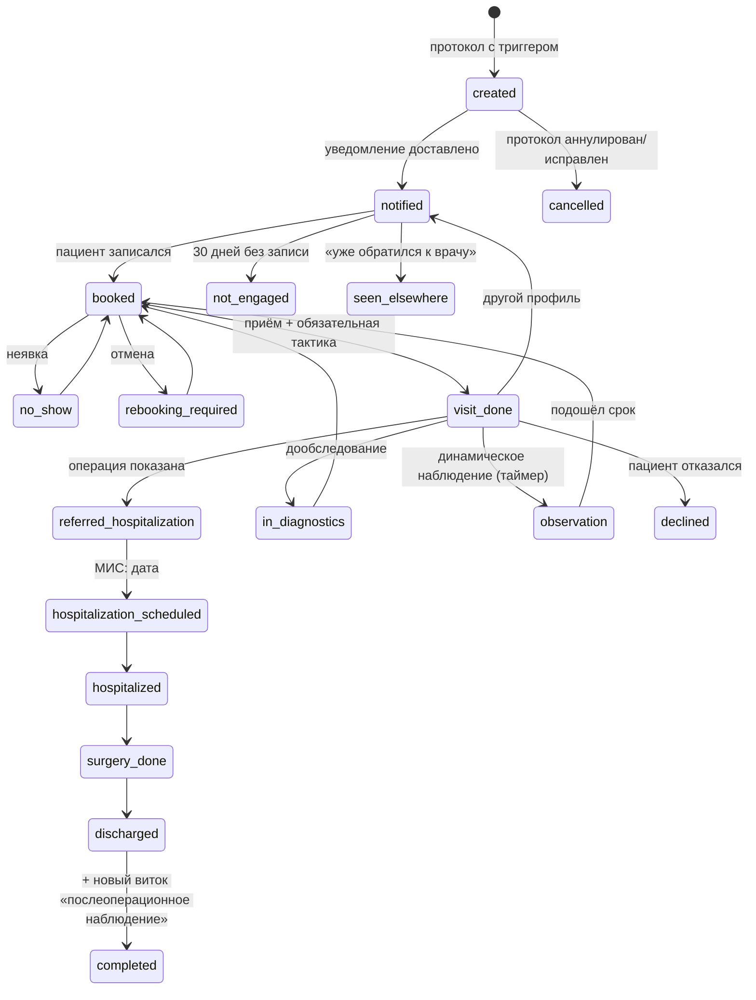
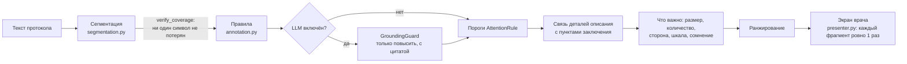
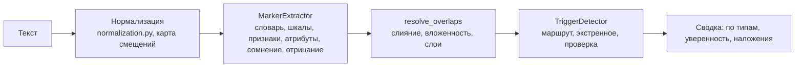
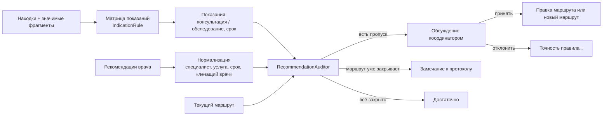

# Архитектура прототипа «СМ-Клиника · Маршрут пациента»

Сервис находит клинически значимые находки в протоколах исследований и ведёт пациента по
циклическому маршруту до выписки и контрольного наблюдения. Фокус не на диагнозе, а на
распознавании триггера и организации следующего безопасного шага.

## 1. Архитектурное видение

### Принципы

1. **Шесть изолированных модулей (будущие микросервисы)**: `processing`, `routing`, `coordinator`,
   `patients`, `doctors`, `audit` (проверка рекомендаций). У каждого свои модели, сервисы, API, страницы и обработчики событий.
2. **Слабая связность данных.** Внешние ключи только внутри модуля. Между модулями хранятся
   только UUID (`patient_id`, `route_id`, `document_id`), поэтому каждую схему можно вынести в свою БД.
3. **Два канала взаимодействия.**
   * **Чтение — через `facade.py`** другого модуля (DTO-словари, без ORM-объектов). При выносе в
     микросервис фасад заменяется HTTP-клиентом с тем же интерфейсом.
   * **Изменения — через события** (`common/events`). Модуль публикует факт («приём завершён»,
     «этап активирован») и не знает, кто его обработает.
   * Правило проверяет архитектурный тест `tests/test_architecture.py`: импорт чужих `models`/`services` запрещён.
4. **Извлечение фактов отделено от решения о маршруте.** LangChain-агент только находит факты с
   цитатой-доказательством. Маршрут выбирает детерминированная матрица (`TriggerRule`) — её можно
   проверить, версионировать и согласовать с медицинским экспертом.
5. **Всё, что меняется, — настройки, а не код**: словарь находок, матрица маршрутизации, шаблоны
   маршрутов, лестницы эскалаций, тексты уведомлений. Всё редактируется в `/admin`.
6. **Модельное время** (`common/clock.py`): сценарии на 24 ч / 72 ч / 7 / 14 / 30 дней прогоняются
   на демонстрации за секунды.

### Схема взаимодействия

| Канал | Где | Прототип | Пилот |
|---|---|---|---|
| Синхронное чтение | `apps/*/facade.py` | вызов Python-функции | HTTP/gRPC-клиент |
| События | `common/events/bus.py` | `InProcessEventBus` (после commit) | `CeleryEventBus` → RabbitMQ/Kafka |
| Надёжность событий | `OutboxEvent`, `ProcessedEvent` | журнал + идемпотентность | transactional outbox + релей |
| Тяжёлые задачи | Celery | eager (синхронно) | worker + beat |

### Celery

* `processing.tasks.process_document` — разбор протокола (вызов LLM может идти десятки секунд), `acks_late`, 3 повтора.
* `routing.tasks.run_escalation_tick` — «пульс» маршрутов (beat, 5 мин): активирует этапы с таймером,
  проходит лестницы эскалаций.
* `coordinator.tasks.snapshot_metrics` — ежечасный снимок воронки.
* `common.tasks.deliver_event` — доставка события обработчику с повторами (режим `EVENT_BUS_BACKEND=celery`).

## 2. Циклический маршрут

Маршрут не линейный: каждое решение врача и каждое событие стационара добавляет новые этапы,
а выписка порождает **новый виток** — маршрут «Послеоперационное наблюдение» (`parent` → `children`, `cycle_no`).

**Матрица → этапы.** `RouteBuilder` берёт находки и рекомендации из JSON агента:
* по `TriggerRule` выбирает шаблон маршрута (одна клиническая группа — один маршрут, сопутствующие
  находки показываются врачу);
* добавляет таймерные этапы из рекомендаций. Пример из постановки: «консультация маммолога и УЗИ
  через 6 мес» → Этап 1 «Консультация маммолога», Этап 2 «УЗИ (через 180 дн.)», этап стоит в
  статусе «запланирован» и активируется `EscalationEngine` за 14 дней до срока.

**Тактика врача → следующий виток** (`RoutePlanner.on_visit_completed`). Завершить приём без
тактики нельзя (валидация в `VisitService` и в форме):

| Тактика | Что делает система |
|---|---|
| Оперативное лечение показано | Направление (дата ≤ 3 раб. дней) → госпитализация → операция → выписка; задачи менеджеру |
| Дообследование | Этапы из назначений + повторная консультация |
| Динамическое наблюдение | Контрольный визит через N дней (таймер) |
| Операция не показана | Назначения или завершение маршрута |
| Пациент отказался | Маршрут закрыт «отказ», сообщения остановлены |
| Другой профиль | Консультация другого специалиста |

**Лестницы эскалаций** (`EscalationPolicy`, часы от активации этапа):

| Политика | Лестница |
|---|---|
| `booking_standard` (сценарий 2) | 24 ч напоминание (ЛК+push) → 72 ч SMS/push → 120 ч задача «позвонить» со скриптом → 14 дн. мягкое уведомление с кнопками «Записаться / Уже обратился / Не планирую» → 30 дн. «не вовлечён» |
| `no_show` (сценарий 3) | 30 мин «приём не состоялся» → далее как сценарий 2 |
| `hospitalization_date` (этап 9) | 24 ч задача менеджеру → 72 ч повтор → 5 дн. руководителю |
| `postop_control` (этапы 11–12) | при выписке контроль записывается заранее; нет слота → уведомление + задача координатору |

**Незавершённый маршрут.** `RoutingFacade.unfinished_routes()` отдаёт и маршруты «не вовлечён» —
на форме приёма врач видит баннер «Незавершённый клинический маршрут», даже если пациент пришёл через месяцы.

**Исправление/аннулирование протокола** (п. 13): новая версия с тем же `external_id` пересчитывает
триггеры без дублей (уникальный индекс `patient + source + trigger`), исчезнувшие триггеры закрываются;
аннулирование закрывает маршруты и останавливает сообщения. Повторная доставка события не создаёт
дублей (`ProcessedEvent`).

## 3. Модель данных

| Модуль | Модели | Связи |
|---|---|---|
| common | `SimulationClock`, `ProcessedEvent`, `OutboxEvent` | — |
| processing | `FindingDefinition`, `SpecialtyAlias`, `AttentionRule` (настройки); `StudyDocument` → `ProcessingJob` → `ExtractionResult` (`analysis`, `advice_meta`) → `Finding` (`rule_id`), `ProtocolSegment`, `RoutingAdvice` | FK внутри; `patient_id` UUID |
| routing | `TriggerRule` → `RouteTemplate` → `RouteTemplateStep`, `EscalationPolicy` (настройки); `PatientRoute` (self-FK `parent`) → `RouteStep` → `RouteEvent` (журнал) | `patient_id`, `source_document_id`, `appointment_id` — UUID |
| doctors | `Specialty`, `ClinicLocation`, `Doctor`, `ScheduleSlot` → `Appointment` → `VisitOutcome` → `Prescription` | `patient_id`, `route_id`, `route_step_id` — UUID |
| patients | `Patient` (`user` — учётная запись для входа), `PushSubscription`, `NotificationTemplate`, `Notification`, `PatientAction` | `route_id` UUID |
| coordinator | `CoordinatorTask`, `RouteReview` → `RouteCorrection`, `RouteFact` (проекция для аналитики), `MetricSnapshot`, `AdviceReview` | всё по UUID; `RouteReview.audit_id`; `AdviceReview.advice_id` без FK (оценка живёт и после пересчёта советов) |
| audit | `IndicationRule` (настройки); `RecommendationAudit` → `AuditIssue` | `document_id`, `patient_id`, `route_id` — UUID |

`RouteFact` — read-модель (CQRS): координатор собирает её из событий всех модулей и не делает JOIN по
чужим таблицам, поэтому аналитика переживёт разделение БД.

## 4. Интеграция с LangChain

`apps/processing/services/ai_agent.py`:

* `FindingExtractor` — абстракция (сервис обработки зависит только от неё, DIP).
* `LangChainFindingExtractor` — `ChatPromptTemplate | llm.with_structured_output(ExtractionPayload)`:
  LLM обязан вернуть объект по pydantic-схеме (`services/schemas.py`). Каждый ответ проходит
  `GroundingGuard` (см. раздел 5): без дословной цитаты, с числом, которого нет в тексте, или с кодом вне
  словаря он отбрасывается, а причина записывается в отчёт.
* `LangChainSegmentClassifier` — LLM-разметчик фрагментов по важности; может только повысить уровень.
* `RuleBasedFindingExtractor` — словарь + регулярные выражения + отрицания («не выявлено», «данных за … нет»)
  + шкалы BI-RADS / TI-RADS / O-RADS + проценты стеноза. Работает без сети.
* `HybridFindingExtractor` — правила гарантируют полноту по словарю, LLM добавляет сложные
  формулировки; при сбое LLM — фолбэк на правила. Отрицание снимает триггер, только если согласны оба.
  У каждой находки источник `source`: `rules` (словарь), `both` (словарь и модель согласны), `llm` (только
  модель, с дословной цитатой). Как отработали движки (статус, модель, время, ошибка) — в `payload["engines"]`
  и `annotation_summary["llm"]`; `ProcessingFacade.engines()` отдаёт это странице протокола.
* Источник доходит до маркеров и триггеров (`markers.py`): метки модели по фрагментам (`ProtocolSegment.llm_labels`)
  подтверждают маркеры словаря (`both`, уверенность +0,05 с причиной в расшифровке) или добавляют маркер
  «только ИИ»; находка с кодом, который словарь нашёл в другом месте протокола, тоже `both`. Триггер берёт
  источник находки и маркера-доказательства. Найденное только моделью показано отдельным блоком
  «Найдено только Qwen», в тексте обведено пунктиром с меткой «ИИ», есть режим подсветки «Только найденное ИИ».
* Причина сбоя модели переводится в понятные слова (`describe_llm_error`: нет связи, тайм-аут, модель не найдена).
* `build_chat_model()` — фабрика провайдера по настройке `LLM_PROVIDER`: `ollama` / OpenAI-совместимый vLLM в
  контуре / `gigachat` / облачные модели только для обезличенных данных хакатона.

## 5. Аналитика признаков: разметка важности для врача

Задача: весь текст протокола сохраняется, но главное (что найдено, какого размера, где) — на переднем
плане, норма и служебные строки — в конце. Разметка детерминирована и воспроизводима; ИИ может только
добавить важность с дословной цитатой.

**Шаги.**

1. **Сегментация.** Протокол режется на предложения и строки «Параметр: значение» с точными границами.
   Предложение, разорванное переносом строки, склеивается обратно. Каждому фрагменту присваивается
   раздел (шапка, описание, заключение, рекомендации, хвост) и орган. Раздел «Заключение» ищется по
   последнему заголовку: поле «Заключение» из шапки 1С не путается с настоящим заключением.
2. **Тип и уровень фрагмента.**

   | Уровень | Когда |
   |---|---|
   | Критично | Экстренная находка словаря (тромбоз) |
   | Высокая важность | Срочная находка словаря или превышен порог (BI-RADS ≥ 4, полип ЖП ≥ 10 мм, стеноз ≥ 50%) |
   | Требует внимания | Плановая находка, изменение в заключении, пункт заключения без кода словаря, значимое изменение описания, не вынесенное в заключение |
   | Незначительные | Изменение в описании без кода словаря, неклассифицированная строка («прочитать») |
   | Норма | Норма или упоминание с отрицанием |
   | Служебное | Параметры, шапка, аппарат, дисклеймер, рекомендации (выводятся отдельным блоком) |

3. **Отрицания.** «не выявлено / не выявляется / не визуализируется» (в том числе с опечатками),
   «Образования: нет», «…: не», перечень с общим отрицанием («кисты, дополнительные образования — не
   определяются»). «Без признаков роста» после миомы отрицает рост, а не миому. Отрицание всегда
   консервативно: если между находкой и «не определяется» есть числа или другое свойство («киста, кровоток
   в ней не определяется»), находка остаётся.
4. **Связь деталей с заключением.** Деталь описания встаёт под пункт заключения и наследует его
   важность, если у них общий код находки, общий признак или родственный признак в **том же органе**
   («узел 26×38 мм» → «миома матки», «аденоматозные узлы» → «ДГПЖ», «гиперэхогенные образования,
   смещаются» → «конкременты желчного пузыря»). Связь только по органу группирует, но не прячет пропуск:
   «киста печени 15 мм» при заключении «диффузные изменения печени» отмечается «не вынесено в заключение».
5. **Что важно.** Размер (только у очаговых изменений), количество, процент, шкала риска, сторона,
   сомнение («?», «нельзя исключить»), «есть в описании, но не вынесено в заключение».
6. **Ранжирование.** Уровень + пункт заключения + размер + шкала + «не в заключении» + сомнение.

**Ограничение ИИ (`grounding.py`).** Ответ LLM принимается только если цитата дословно есть в тексте,
каждое число есть в тексте, код и специальность — из словаря, фрагмент существует. LLM может только
повысить важность; попытка понизить игнорируется и считается. Фрагменты, которые LLM пропустил, остаются
размеченными правилами. Выжимку для пациента всегда собирает шаблон. Счётчики отброшенного видны врачу
и на дашборде («Контроль ИИ»).

### 5.1. Маркеры и триггеры (`markers.py`)

Поверх разметки фрагментов строится плоский список маркеров и триггеров с позициями в исходном тексте.
Шаги идут строго по очереди, у каждого свой класс (SRP): извлечение → маркеры → триггеры → сводка.

* **Нормализация.** Поиск идёт по нормализованному тексту (ё/е, латинские буквы в кириллице, «Т» в
  TI-RADS, лишние пробелы), но найденное возвращается в позициях исходного текста через карту смещений.
  Совпадение после исправления помечается `corrected` и снижает уверенность.
* **Маркер:** `id`, `type`, `start`/`end`, `text`, `code`, `confidence`, `level`, `factors` (из чего
  сложилась уверенность), `rule_id` (`dictionary:gallbladder_polyp@v3#1`, `scale:birads`,
  `lexicon:sign:node`, `attribute:size`, `cue:uncertain`), `parent_id`, `layer`, `subsumed_by`.
* **Наложения не теряются.** Одинаковые тип и код сливаются; признак внутри находки получает
  `subsumed_by`; размер и сторона внутри находки получают `parent_id`. Каждый случай пишется в
  `overlaps` (`same_span`, `nested`, `partial`), слои раскладываются жадно.
* **Триггер:** `id`, номер Т1…, `type` (`route`, `emergency`, `review`), позиция, `evidence` (цитата),
  `confidence`, `rule_id` (`matrix:<правило>@v<версия>`, `dictionary:<код>@v<версия>`,
  `heuristic:not_in_conclusion`), маршрут и специальность. Дубли по (тип, правило, код) сливаются,
  остальные места попадают в `also`.
* **Уверенность** (`scoring.py`): база по виду правила (словарь и матрица выше эвристики) плюс факторы
  с причинами: сомнение, исправленный текст, находка есть или нет в заключении.
* **Подсветка** (`presenter.layered_evidence_html`): текст режется по границам маркеров, каждый кусок
  выводится один раз (тест сверяет текст до и после). Фон — самый внутренний маркер, слои — рамки,
  отрицание — пунктир, триггер — тень, подчёркивание и метка Т1 через CSS `::before` (текст не меняется).
  Цвета по типам проверены на контраст WCAG AA. Режимы: все маркеры, только триггеры, только выбранный
  тип; клик по подсветке выделяет строку в таблице «Выявленные триггеры», и наоборот.
* Разметка хранится в `ExtractionResult.analysis` с версией; если версия устарела, она пересчитывается
  при чтении, без повторной обработки протокола.

### 5.2. Советы ИИ по маршрутизации (`routing_advice.py`)

Отдельный блок, не смешанный с аналитикой. После сохранения разметки Celery-задача просит Qwen (LangChain,
structured output по pydantic-схеме) предложить маршрут: текст, обоснование, цитата, уверенность модели,
маршрут и исполнитель. В запросе модель видит источник каждого триггера («только ИИ» проверяется
внимательнее). Ответ модели целиком (`include_raw`) и время ответа сохраняются в `advice_meta` и показаны под
советами. Если модель настроена, но не ответила или ответила не по схеме, на странице ошибка и кнопка
«Спросить Qwen ещё раз»; демо-советы вместо ответа модели не подставляются. Без настроенной модели работает
демо-режим: советы собираются из триггеров и подписаны как демо. Каждый совет проверяется (`ground_advice`): цитата есть в тексте, маршрут и
специальность есть в справочнике, совпадает ли он с матрицей. Маршрут по совету сам не меняется.
Координатор принимает, отклоняет (с комментарием) или корректирует (комментарий и маршрут из каталога);
оценка пишется в `AdviceReview` (user_id, advice_id, verdict, comment, timestamp) со снимком совета.

## 6. Проверка рекомендаций: необходимость коррекции маршрута

Вход: рекомендации диагноста из протокола или назначения врача на приёме. Модуль `audit` сверяет их
с показаниями по находкам и с текущим маршрутом.

* Показание закрыто, если в рекомендациях есть подходящий специалист (список допустимых: например,
  гинеколог или оперирующий гинеколог), пациент уже на приёме у него или этап есть в маршруте.
* «Консультация лечащего врача» без профиля показание не закрывает; это пишется в пояснении.
* Срок рекомендации сверяется с максимальным по правилу (BI-RADS 4: не «через 6 месяцев»).
* Находка только в описании (не в заключении) не запускает маршрут, поэтому её пропуск в рекомендациях
  уходит на обсуждение как major.
* Вердикт: critical/major → «недостаточно» (обсуждение и задача координатору); minor → «есть замечания»;
  иначе «достаточно». Каждое замечание содержит цитату-основание и правило.
* Решение принимает только координатор, по каждому замечанию. Принятое — событие правки маршрута
  (если маршрута нет, он создаётся). Решения возвращаются в модуль и дают точность каждого правила.
* Модуль подключён после маршрутизации: к моменту проверки маршрут по протоколу уже построен.
  При асинхронной шине проверку ставят в цепочку после построения маршрута (Celery chain).

## 7. API (`/api/v1/`)

| Процесс | Эндпоинт |
|---|---|
| Загрузка протокола | `POST processing/documents/` (multipart: `patient_id`, `file`, `external_id`) → 202 |
| Результат обработки | `GET processing/documents/{id}/` (в том числе итог разметки; новые поля `result.analysis`, `result.qwen_advice`, `rule_id` только добавлены), `GET …/{id}/text/` |
| Маркеры и триггеры | `GET processing/documents/{id}/analysis/` |
| Советы ИИ и их оценка | `GET processing/documents/{id}/advice/`, `GET/POST coordinator/advice-reviews/`, `GET coordinator/advice-reviews/stats/` |
| Проверка рекомендаций | `POST audit/check/` (без сохранения; можно передать свои рекомендации текстом), `GET audit/audits/?open=1`, `GET audit/stats/`, `GET audit/documents/{id}/` |
| Генерация маршрута из JSON | `POST routing/routes/generate/` (`dry_run` — без сохранения, с объяснением) |
| Маршрут и журнал | `GET routing/routes/?patient_id=`, `GET routing/routes/{id}/journal/` |
| Матрица (настройка) | `GET/POST/PATCH routing/rules/` |
| Слоты под этап | `GET patients/{id}/steps/{step_id}/slots/`, `GET doctors/slots/?specialty=` |
| Личный кабинет | `GET patients/{id}/…` только сотруднику или самому вошедшему пациенту; список пациентов пациенту закрыт |
| Запись пациента | `POST patients/{id}/book/` (только этап «ожидает записи» и совпадающая специальность) |
| Действия из уведомления | `POST patients/{id}/route-action/` (`seen_elsewhere`, `decline`, `callback`, `confirm`) |
| Врач | `GET doctors/appointments/{id}/context/`, `POST …/complete/` (тактика обязательна), `POST …/no-show/` |
| Координатор | `GET/PATCH coordinator/tasks/`, `GET coordinator/reviews/compare/?route_id=`, `POST coordinator/reviews/{id}/resolve/` |
| Аналитика | `GET coordinator/analytics/` (`?stage=` — список пациентов шага воронки) |
| События МИС | `POST mis/events/` (`protocol.signed/corrected/annulled`, `hospitalization.scheduled`, `patient.hospitalized`, `surgery.done`, `patient.discharged`; HMAC-подпись). В прототипе — заглушка: проверка по контракту и журнал (`GET mis/events/`), обработка включается `MIS_WEBHOOK_MODE=live` |
| Проверка качества разбора | `POST processing/quality-runs/` (до 100 протоколов или zip + `labels.csv`), `GET processing/quality-runs/{id}/` — сводка, точность и полнота, строки по протоколам. Без записи пациентов и маршрутов |
| Демо-время | `POST sim/advance/ {"hours": 24}`, `POST sim/reset/` |

## 8. Безопасность и ПДн

* Система не ставит диагноз и не назначает лечение: только триггер и организация шага; решение — за врачом
  (обязательная тактика).
* Экстренные находки (`is_emergency`) — только задача персоналу, пациенту ничего не уходит.
* Нейтральные тексты; в SMS — ни слова о находке («в личном кабинете новое сообщение»). В push нет диагноза
  и специальности, только «Рекомендуется консультация профильного специалиста» и ближайший приём
  (врач, дата, клиника); правила и причины — в `docs/PUSH_GUIDE.md`.
* Пациент входит по номеру карты и паролю (хеш в учётной записи Django), сессия пациента отдельно от
  сотрудников, видит только свой кабинет; 5 ошибок подряд закрывают вход по карте на 15 минут. В пилоте
  вход заменяется SSO личного кабинета клиники или кодом из SMS.
* Выданные протоколы кейса не публикуются: в репозитории только сводка-счётчики `docs/case_run_summary.json`.
  Синтетический поток `demo_batch` запускается только явным флагом, аналитика по умолчанию пустая до загрузки.
* Антиспам: лимит сообщений в сутки, тихие часы для push/SMS, дедупликация, остановка при закрытии маршрута.
* ПДн: в прототипе только псевдонимы; в пилоте ПДн остаются в МИС, модель — в контуре клиники.
* Объяснимость: цитата, атрибуты, правило и его версия, уверенность; журнал `RouteEvent` по каждому действию.

## 9. Путь к микросервисам

1. `EVENT_BUS_BACKEND=celery` → затем RabbitMQ/Kafka (меняется только реализация `EventBus.publish`).
2. Фасады → HTTP-клиенты; префиксы `/api/v1/<module>/` уже разведены на шлюзе.
3. Отдельная БД на модуль (связей между схемами нет).
4. Processing с LLM — отдельный узел с GPU в контуре клиники.

## 9a. Очередь разбора протоколов

`processing/services/jobs.py`. Загрузка пачки создаёт `ProcessingJob` в статусе `queued` и отвечает сразу.
Исполнитель (фоновый поток сайта, `process_queue` или Celery-воркер очереди `llm`) атомарно забирает задачу
(`queued → running`, `attempts + 1`, `worker`), поэтому повторная доставка сообщения не запускает второй
разбор. Протоколы идут раньше советов ИИ (советы ждут в `advice_meta.status = pending`). Зависшие задачи
возвращает `recover_stale` (поток очереди раз в минуту, Celery beat раз в 5 минут, процесс сайта при старте
забирает задачи умерших процессов). Предохранитель `ai_agent.circuit` после тайм-аута модели на время
отключает вызовы, очередь ждёт модель, затем идёт по словарю; `ProcessingJob.llm_status` отмечает протоколы,
которые стоит повторить с ИИ. Повтор публикует события с ключом `:rerun:<job>`; обработчики идемпотентны.
`ProcessingJob.timings` хранит время шагов, `batch_progress` считает ход пачки и оценку остатка.

## 10. Что проверено и ограничения прототипа

* 103 автотеста (`python manage.py test tests`). Новое: три роли со своим входом (пациент, координатор, врач;
  чужой раздел закрыт, врач видит только свои приёмы); проверка процесса очереди не падает на Windows. Ранее: очередь разбора пачки (загрузка отвечает сразу,
  протоколы по одному, советы после протоколов, задачу забирает один исполнитель, зависшие возвращаются,
  при зависшей модели пачка не ждёт тайм-аут на каждом протоколе, «Повторить с ИИ» без двойных маршрутов).
  Ранее: словарь и модель вместе через имитацию сервера Ollama
  (источник находок, маркеров и триггеров, блок «Найдено только Qwen», ответ модели в советах, без демо-подмены
  при сбое модели); маркеры и триггеры (точные позиции, правило, уверенность,
  дедупликация, наложения, текст в подсветке не меняется, контраст палитры), совместимость API, советы ИИ и
  оценки координатора, вход пациента и закрытые чужие кабинеты, push без диагноза. Ранее: извлечение (дедупликация объединённых ячеек 1С, отрицания, шкалы, интервалы, отбрасывание
  галлюцинаций LLM), полный цикл до контрольного визита, 30 дней без записи → «не вовлечён», исправление и
  аннулирование протокола, пример «маммолог + УЗИ через 6 мес», экстренная находка, изоляция модулей;
  разметка (ни один символ не теряется, важное сверху, ИИ не может придумать, скрыть или понизить, отрицания,
  связь в пределах органа, переносы строк); проверка рекомендаций и решение координатора.
* Прогон по 89 выданным протоколам (`manage.py evaluate_protocols`, без записи в БД): правило маршрута сработало в 53
  (59,6%), любой триггер в 54 (60,7%), 60 триггеров (маршрут 53, проверка 7), 1328 маркеров, 171 наложение;
  инварианты разметки выполнены во всех 89 (2957 фрагментов, ни один не потерян и не задвоен); заключение не
  найдено в 1. Проверка рекомендаций: достаточно — 55, есть замечания — 33, на обсуждение — 1 (BI-RADS 4 без
  рекомендации биопсии). Значимое изменение не вынесено в заключение — в 7 протоколах, каждое проверено
  вручную. Точность и полноту можно посчитать только после разметки с медицинским экспертом (`--labels`).
* Пороги внимания и матрица показаний — демо-набор по кейсу; перед пилотом их согласует медицинский эксперт.
* LLM-ветка (находки, разметка фрагментов, советы) проверена через имитацию сервера Ollama
  (`tests/fake_ollama.py`): тот же HTTP-протокол, поэтому проверен весь путь LangChain → ChatOllama → HTTP →
  схема → проверка цитат. На настоящем Qwen в среде разработки не запускалась (модель там недоступна);
  проверка на своём компьютере: `python manage.py check_llm`.
* Разбор `.doc` идёт через LibreOffice или antiword; в среде разработки конвертация не запустилась, `.doc` не проверен.
* Push и SMS имитируются; расписание — заглушка контракта сервиса 1С. Вход есть у всех трёх ролей (пациент по
  карте, координатор и врач по логину); в пилоте заменяется SSO клиники. API `/api/v1/` для интеграции пока открыт.
* Советы Qwen проверены в демо-режиме и через имитацию сервера Ollama; на настоящем Qwen не запускались.
